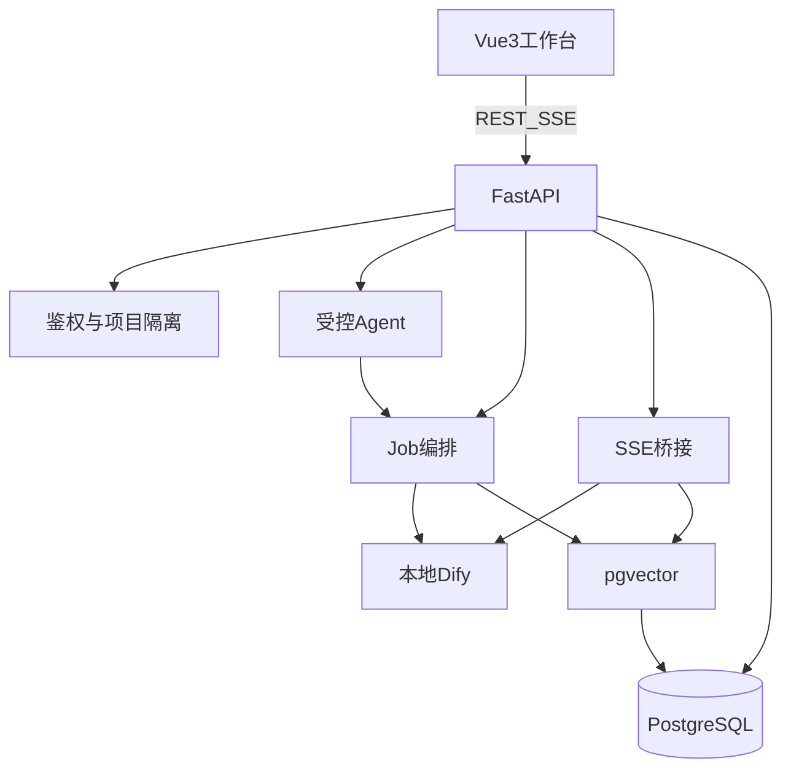

# 小说生成器 Web 产品需求文档（PRD）

> **实现按步骤推进**：详细可执行规格见 [`docs/steps/`](steps/)。本文件为产品规格总览与导航。  
> 工程仓库：`banana-agents`（`backend/` + `frontend/`）。历史参考：早期本地 GUI 验证过四步流水线思路；**本产品为独立 Web 实现，不依赖桌面代码**。

| 项 | 内容 |
|----|------|
| 版本 | v1.2 |
| 状态 | 一期定稿（Web 产品规格） |
| 产品名称 | 小说生成器 Web（团队内网） |
| 产品形态 | 浏览器访问：简单登录 + 多项目隔离 |
| 一期范围 | 设定→目录→草稿→定稿 + SSE + 受控 Agent + 本地 Dify + pgvector RAG + 一致性审校 |
| 技术栈 | Vue3 + SSE；FastAPI + LangChain；本地 Dify；PostgreSQL + pgvector |

---

## 1. 背景与目标

面向创作团队的内网 Web 小说生成工作台：分步生成、人工改稿、状态维护与一致性审校，支持多项目、登录与可运营 Prompt/工作流。

**要解决的问题**：长篇人设/世界观矛盾与伏笔丢失；上下文窗口有限；团队共享与审计；可控自然语言入口（受控 Agent）。

### 产品目标

1. 跑通「设定 → 目录 → 草稿 → 定稿」闭环，每步可人工编辑。
2. 章节草稿 SSE 流式展示与改稿。
3. 受控 Agent（意图路由 + 工具白名单）。
4. 本地 Dify 承载生成/审校；LangChain（FastAPI）负责 Agent、Job、SSE 桥接与 RAG。
5. pgvector 跨章节检索；一期含一致性审校（知识库导入与批量生成放二期）。

### 成功标准

- 浏览器完成多章节一期闭环；审校结构化展示冲突。
- Agent 无法调用白名单外工具；项目按用户隔离。
- 定稿后 RAG 可命中本章并影响后续草稿。
- 种子账号 `admin` / `123456` 可走完主路径。

### 非目标（一期不做）

公网 SaaS / 公开注册 / 计费；细粒度 RBAC / 项目共享；外部知识库导入 / 批量生成；导出增强；任意代码执行或开放式联网 Agent。

---

## 2. 用户与主场景

| 角色 | 说明 | 权限 |
|------|------|------|
| 管理员 | 种子 `admin`；维护设置中的模型预设 | `is_admin=true` |
| 作者/编辑 | 后续手工入库 | 仅本人项目 |

运维参数（Dify URL、Job 超时等）只走 backend 环境变量。

**主路径**：登录 → 设置模型预设 → 创建项目 → 设定（Job）→ 目录（Job）→ 草稿（SSE）→ 改稿 → 定稿（Job）→ 可选审校；Agent 触发白名单工具，流式再调 SSE。

---

## 3. 功能全貌

| Web 模块 | 要点 | 主要 API / 页面 | 步骤文档 |
|----------|------|-----------------|----------|
| 登录与项目 | 归属隔离；种子 admin | `/api/auth/login`，项目 CRUD | [M1](steps/01-m1-foundation.md) |
| 全局设置 | llm / embedding / choose_configs | `/api/settings` | [M1](steps/01-m1-foundation.md) |
| Step1 设定 | Job + `wf_architecture` | `POST .../architecture/generate` | [M2](steps/02-m2-pipeline-rag.md) |
| Step2 目录 | Job + `wf_blueprint` | `POST .../blueprint/generate` | [M2](steps/02-m2-pipeline-rag.md) |
| Step3 草稿 | SSE + `wf_chapter_draft` | `POST .../chapters/{n}/draft` | [M2](steps/02-m2-pipeline-rag.md) |
| Step4 定稿 | Job + `wf_finalize_summary` + pgvector | `POST .../finalize` | [M2](steps/02-m2-pipeline-rag.md) |
| 一致性审校 | Job + `wf_consistency_review` | `POST .../consistency-check` | [M3](steps/03-m3-agent-review.md) |
| 受控 Agent | 意图路由 + 白名单；JSON | `POST .../agent/chat` | [M3](steps/03-m3-agent-review.md) |
| RAG | 定稿入库；草稿检索注入 | LangChain + pgvector | [M2](steps/02-m2-pipeline-rag.md) |

跨步骤不变量（鉴权、Job/SSE、模型路由、Dify env）见 [00-shared](steps/00-shared.md)。

---

## 4. 逻辑架构

前端不直连 Dify；Embedding/RAG 不走 Dify。

---

## 5. 实现步骤（里程碑）

| 步骤 | 内容 | 文档 |
|------|------|------|
| 共享约定 | 鉴权、Job、SSE、模型、Dify、env | [00-shared.md](steps/00-shared.md) |
| M1 | 仓库骨架；admin 登录；项目 CRUD；设置读写；Job API 壳 | [01-m1-foundation.md](steps/01-m1-foundation.md) |
| M2 | Dify 四流（设定/目录/草稿/定稿）；SSE；定稿 + pgvector | [02-m2-pipeline-rag.md](steps/02-m2-pipeline-rag.md) |
| M3 | 受控 Agent + 审校面板 + 审计 | [03-m3-agent-review.md](steps/03-m3-agent-review.md) |
| M4 | Compose 部署与一期验收清单 | [04-m4-deploy-acceptance.md](steps/04-m4-deploy-acceptance.md) |

一期总验收、二期 backlog 与风险汇总见 [M4](steps/04-m4-deploy-acceptance.md)。

---

## 附录：与前身能力对照（非实现依赖）

| Web 概念 | 前身中曾出现的类似产物（仅参考） |
|----------|----------------------------------|
| `projects.architecture` | 设定文本文件 |
| `chapter_blueprints` | 章节目录文本 |
| `character_state` / `global_summary` | 角色状态 / 全局摘要文件 |
| `chapters` | 分章正文文件 |
| `chapter_chunks` + pgvector | 本地向量目录 |
| `app_settings` | 本地 JSON 配置里的模型预设形状 |

---

*v1.2：Web 主叙事。分步实现见 `docs/steps/`。*
