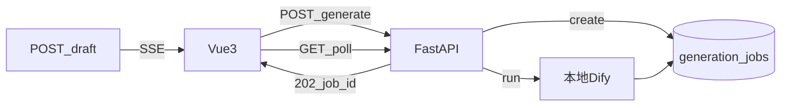

# 跨步骤约定（Shared）

> 所有里程碑共用的不变量。实现细节索引：[PRD 总览](../PRD.md) · [M1](01-m1-foundation.md) · [M2](02-m2-pipeline-rag.md) · [M3](03-m3-agent-review.md) · [M4](04-m4-deploy-acceptance.md)

---

## 目标

固定鉴权、长任务模型、模型预设形状、Dify/运维 env 与禁止项，避免各里程碑各自发明协议。

## 范围 / 不做

- **做**：Bearer、项目归属、Job/SSE 分工、配置形状、五流逻辑名与 env。
- **不做**：具体页面交互、各步 Prompt 正文、公网部署细则。

---

## 鉴权与隔离

- 除登录外：请求头 `Authorization: Bearer <token>`。
- 项目 API 强制 `owner_id == current_user.id`；伪造他人 `project_id` → 403/404。
- 密码 bcrypt/argon2 哈希；前端不持有 Dify Key；密码非明文存储/回传。

---

## 长任务模型（定死）

| 模式 | 适用 |
|------|------|
| Job + 轮询 | 设定、目录、定稿、审校 |
| SSE | **仅**章节草稿 |



### `generation_jobs` 字段

`id`, `project_id`, `user_id`, `type`, `status`（pending / running / succeeded / failed / cancelled）, `progress`, `result_ref`, `error`, 时间戳。

### Job API

- 各 generate / finalize / consistency-check → 建议 HTTP 202 + `{ job_id }`
- `GET /api/jobs/{job_id}`
- `POST /api/jobs/{job_id}/cancel`

### SSE 事件（草稿）

`meta` / `token` / `usage` / `done` / `error`（JSON data）。中断：保存已生成文本 + 用户重试。

### Agent 与 SSE（定死）

- `POST .../agent/chat` **只返回 JSON**（可含 `job_id` 或 `sse_endpoint`）。
- 禁止在 Agent 响应中混推正文 token；草稿一律走 `/chapters/{n}/draft` SSE。

---

## 模型预设体系

全局一份配置存 `app_settings`，由前端设置页维护（admin）。

**`llm_configs[name]`**：`api_key`, `base_url`, `interface_format`, `model_name`, `temperature`, `max_tokens`, `timeout`

**`embedding_configs[name]`**：同上 + `retrieval_k`（默认 4）

**`choose_configs`**：`architecture_llm` / `chapter_outline_llm` / `prompt_draft_llm` / `final_chapter_llm` / `consistency_review_llm`（值为预设名）

- 一期固定 **`EMBEDDING_DIM=1536`**；变更须重建 `chapter_chunks`。
- `projects.model_routing` 可选；缺省跟全局 `choose_configs`。
- 种子可写空 `api_key`，部署后在设置页填写。

| 类别 | 存放 | 谁改 |
|------|------|------|
| 模型 / 任务路由 / embedding 预设 | DB + 设置页 | admin |
| Dify、Job 超时、EMBEDDING_DIM、JWT、DATABASE_URL | backend `.env` | 运维 |

---

## 本地 Dify 与 LangChain

| 组件 | 职责 |
|------|------|
| 本地 Dify | 五个生成/审校工作流；调 Prompt |
| LangChain（FastAPI） | Agent、Job、Dify 调用、SSE 桥接、Embedding、RAG |
| PostgreSQL / pgvector | 业务数据与向量 |

前端不直连 Dify；**Embedding/RAG 不走 Dify**。

### 一期五个工作流

| 逻辑名 | 用途 | 调用 | 主要输入 → 输出 |
|--------|------|------|-----------------|
| `wf_architecture` | 设定 | Job | 主题等 → architecture + character_state |
| `wf_blueprint` | 目录 | Job | architecture 等 → 蓝图 |
| `wf_chapter_draft` | 草稿 | 流式→SSE | 上下文 → token 流 |
| `wf_finalize_summary` | 定稿摘要/角色 | Job | 正文+旧状态 → 新摘要/角色 |
| `wf_consistency_review` | 审校 | Job | 正文+设定等 → 冲突 JSON |

降级：Dify 不可用时可用 LangChain 直连 LLM；一期目标仍是接通本地五流。

---

## 运维 env（无前端）

```text
JOB_TIMEOUT_SEC=600
JOB_MAX_CONCURRENCY=2
DIFY_BASE_URL=http://<local-dify>
DIFY_API_KEY=...
DIFY_WF_ARCHITECTURE=...
DIFY_WF_BLUEPRINT=...
DIFY_WF_CHAPTER_DRAFT=...
DIFY_WF_FINALIZE_SUMMARY=...
DIFY_WF_CONSISTENCY_REVIEW=...
EMBEDDING_DIM=1536
DATABASE_URL=...
JWT_SECRET=...
```

---

## 禁止项

- Agent / 工具：Shell、任意 HTTP/SQL、跨项目、动态代码执行、开放式联网 Agent。
- Agent 响应中混推草稿正文 token。
- 前端暴露 Dify Key 或运维密钥。

---

## 非功能（共性）

内网部署；Job 可取消；SSE 中断可保留文本；RAG `top_k` 默认 4；记录 Job / Agent / RAG 日志。

---

## 验收清单（共享）

- [ ] 除登录外接口需 Bearer；无 token → 401
- [ ] 他人项目不可读改；伪造 id → 403/404
- [ ] Job 状态机与 cancel 行为符合上表
- [ ] 草稿仅走 SSE；Agent 只返回 JSON
- [ ] Dify Key / JWT 仅服务端；设置页不暴露运维 env
