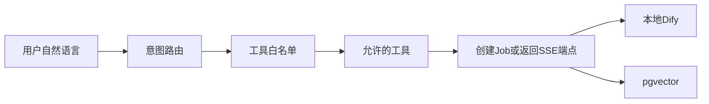

# M3：受控 Agent 与一致性审校

> 前置：[M2](02-m2-pipeline-rag.md) · 约定：[00-shared](00-shared.md) · 下一步：[M4](04-m4-deploy-acceptance.md)

---

## 目标

交付受控 Agent（意图路由 + 工具白名单 + 审计）与一致性审校面板；接通 `wf_consistency_review`。Agent 只返回 JSON，草稿流式仍走 SSE。

## 范围 / 不做

**做**

- `POST .../agent/chat`：意图路由 → 白名单工具 → 创建 Job 或返回 `sse_endpoint`
- 工具白名单与禁止项落地；写入 `agent_audit_logs`
- 审校 Job + 结果 JSON 展示（不自动改文）
- 工作台：审校面板、Agent 侧栏、审计日志查看

**不做**

- 白名单外工具、Shell、任意 HTTP/SQL、跨项目、动态代码
- Agent 响应中混推正文 token
- 审校后自动改写（二期）
- 扩展 Agent 工具（须评审后注册，二期）

---

## 数据与 API

### 实体

**`consistency_reviews`**：关联 `project_id`、`chapter_number`、结构化冲突结果、时间戳等（按实现落库）

**`agent_audit_logs`**：鉴权 → 归属 → Schema → 白名单 全链路审计记录

### 接口

| 方法 | 路径 | 说明 |
|------|------|------|
| POST | `/api/projects/{id}/agent/chat` | **仅 JSON**；可含 `job_id` 或 `sse_endpoint` |
| GET | `/api/projects/{id}/agent/audits` | 审计日志 |
| POST | `/api/projects/{id}/chapters/{n}/consistency-check` | 202 + `job_id` |
| GET | `/api/projects/{id}/chapters/{n}/reviews` | 审校结果列表/详情 |
| POST | `/api/projects/{id}/rag/query` | Agent `tool_rag_query` 可复用 |

Job 轮询/取消沿用 [00-shared](00-shared.md)。

---

## 受控 Agent

### 流程

### 意图

`generate_architecture` / `generate_blueprint` / `generate_draft` / `finalize_chapter` / `consistency_check` / `edit_artifact` / `rag_query` / `clarify` / `reject`

### 工具白名单

| 工具 | 作用 | 关键参数 |
|------|------|----------|
| `tool_generate_architecture` | 创建设定 Job | `project_id` |
| `tool_generate_blueprint` | 创建目录 Job | `project_id`, `start_chapter?` |
| `tool_generate_draft` | 返回 SSE 路径与参数（**不推 token**） | `project_id`, `chapter_number`, `guidance?` |
| `tool_finalize_chapter` | 定稿 Job | `project_id`, `chapter_number`, `enrich?` |
| `tool_consistency_check` | 审校 Job | `project_id`, `chapter_number` |
| `tool_get_artifact` | 读制品 | `project_id`, `artifact_type`, … |
| `tool_rag_query` | 只读检索 | `project_id`, `query`, `top_k?` |

禁止：Shell、任意 HTTP/SQL、跨项目、动态代码。

### Agent 与 SSE（定死）

- `generate_draft` 意图 → 返回 `sse_endpoint`（及参数），由前端再调 `/chapters/{n}/draft`。
- 禁止在 Agent 响应中混推正文 token。

### 审计

每次调用：鉴权 → 归属校验 → Schema 校验 → 白名单校验 → 写 `agent_audit_logs`。

---

## 一致性审校

- Job + Dify `wf_consistency_review`：正文 + 设定等 → 冲突 JSON。
- 前端审校面板结构化展示；**不自动改文**。
- 可选场景：查看历史 reviews；与章节号关联。

---

## 实现要点

- 前端：Agent 侧栏 + 审校面板；若响应含 `sse_endpoint`，跳转/调用现有草稿 SSE。
- 后端：意图路由与工具执行与现有 Job/SSE/RAG 服务复用，不另开旁路写库。
- Dify 第五流 `DIFY_WF_CONSISTENCY_REVIEW` 见 [00-shared](00-shared.md)。

---

## 验收清单

- [ ] Agent 白名单外工具被拒绝，并有审计记录
- [ ] 草稿意图返回 SSE 端点/参数，响应中无正文 token 混流
- [ ] 设定/目录/定稿/审校意图可创建 Job，前端可轮询
- [ ] `tool_rag_query` / `tool_get_artifact` 只读且受项目归属约束
- [ ] 审校 Job 成功后面板展示结构化冲突；不自动改章节正文
- [ ] `GET .../agent/audits` 可查看近期调用
- [ ] 跨项目 `project_id` 在 Agent 工具中同样 403/404
